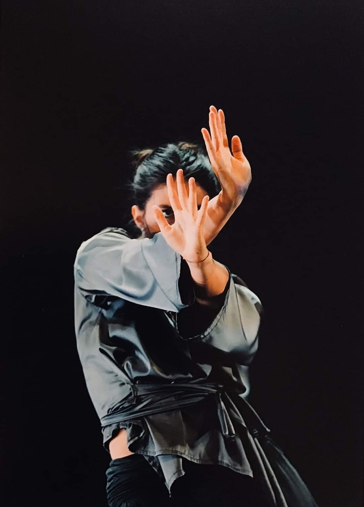

# Genuary 2021

Entries for the [#genuary2021](https://genuary2021.github.io) generative art challenge. Focus on computational physics & musical crossovers.

### [```MAGNETIC_BREATH```](source/magnetic_breath.m)

    Entry for:
    > JAN.08 | Curve only.
    > JAN.18 | One process grows, another process prunes.
    > JAN.24 | 500 lines.
    


What you see is the evolution of the quantum energy levels of a _diatomic Hubbard chain_ as a periodically fluctuating electron-electron interaction drives a magnetic transition. Horizontal axis represents the _degree of ionicity_ of the material ( let's say _"how much the two atoms are different"_); the vertical axis counts just the _mean-field_ energy of single electrons (albeit all correlated by their repulsion, we approximately describe each electron as independent on the others, but _"drawn in a averaged nebula of negative charge"_, which accounts for all his fellows). There are _two types_ of electrons, namely the _spin-up_ and _spin-down_ ones. The discriminant is an opposite intrinsic magnetic field. We disintinguish them by colors, as much as one conventionally does with _north_ and _south_ poles of a macroscopic magnet! Whenever you see a mixed violet color, opposite electronic spins are physically indistinguishable and you have a completely demagnetized chain. If instead you can distinguish the red and blue colors, the two spin-families are behaving differently and thus some magnetism is happening in the material! Hence the title: **magnetic breath**.

About the #genuary prompts: 
- _**Curve only**_ is pretty much self-evident: a solid-state "band-structure" is made of just curves.
- _**One process grows, another process prunes**_ is more interesting: I refer here to the progressive expansion of the magnetic phase, at the expense of the demagnetized one. And viceversa.
- _**500 lines**_ may appear trivial, but it's not: here you see exactly 500 lines, but the true number of quantum levels is not 500. If you'd happen to plot all the 10<sup>4</sup> lines you'll get a nasty mess of aliased crap. If you instead enforce physically the number of levels to be 500 (which amounts to making way shorter the diatomic chain), you'll dive in the realm of nanostructures, with highly discretized physics, and will lost all the nice smoothness of the plot. Aestethics demands a proper subset of 500 "representative" levels. So I claim to have _strongly_ satisfied also this prompt :D

Finally, if you want to read more about the physics behind this divertissement, consider to take a look [here](https://github.com/Bellomia/CondMatLab_SISSA/blob/main/HFHubbardLab/Ionic_Hubbard_Chain_%5BBELLOMIA%5D.pdf). Enjoy!

### [```FLAMBOYANT_QUASICRYSTAL```](source/flamboyant_quasicrystal.py)

    Entry for:
    > JAN.04 | Small areas of symmetry.
    > JAN.06 | Triangle subdivision.
    > JAN.13 | Do not repeat.
    > JAN.23 | #264653 #2a9d8f #e9c46a #f4a261 #e76f51, no gradients.
    
    

### [```AUDIO_PORTRAITS```](source/audio_portraits.m)

    Entries for:
    > JAN.03 | Something human.
    > JAN.14 | // SUBDIVISION
    > JAN.28 | Use sound.
    
**> HER_and_ME**

| [](https://youtu.be/2kqCiJIpTlI "click to hear sound") | <table> <tbody> <tr> <td> [](https://youtu.be/oVvkGehgye0 "click to hear sound") </td> </tr> <td>  </td> </tr> </tbody> </table> |  |
|:-: | :-: | :-: |

**> SELF_PORTRAIT**

[](http://www.youtube.com/watch?v=kpWXcR0KabA "click to hear sound")
